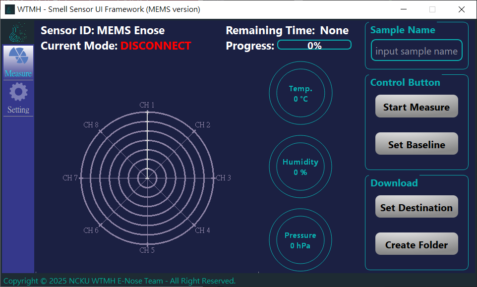
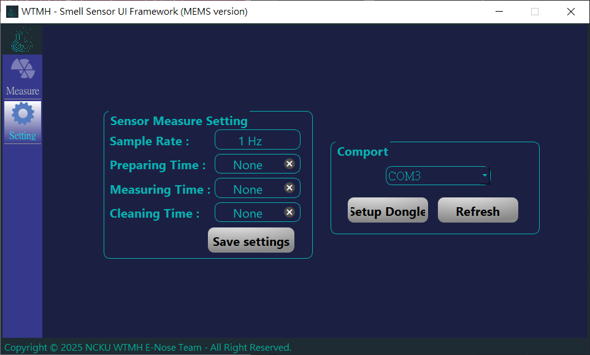

# E-nose-GUI-MEMS-version
This project develops an E-Nose sensor and GUI on the Jetson Nano.

## Functions
- Measurement Page
  - Measure VOCs via Enose sensor, and divide into 3 stage: `Prepare`, `Measure`, `Clean`
  - Record data into csv files
    
    

- Setting Page
  - Set times of each stage
  - Search Enose sensor and do the connection
    
    

- Enose Machine based on Jetson Nano
  
